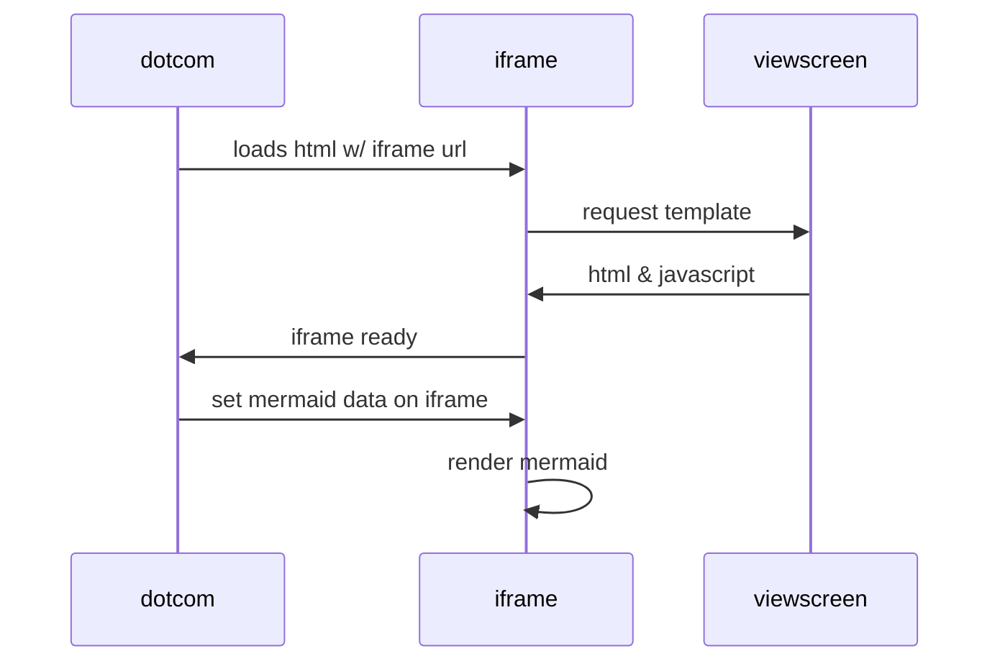
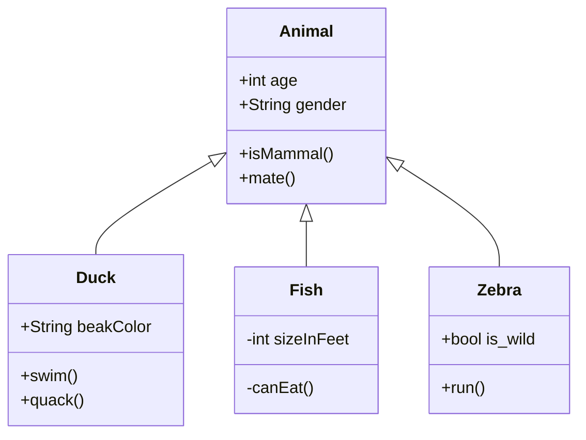

# mermaid_examples

Several months ago I stumbled on a new feature that was added to GitHub Markdown, “mermaid.js”.  This is a JavaScript library that uses the d3.js library for data visibility.  Really cool stuff.  

Here are links to the library:

https://github.com/mermaid-js/mermaid/blob/develop/README.md

https://github.com/mermaid-js/mermaid/blob/develop/docs/developer-docs/configuration.md

https://github.com/mermaid-js/mermaid/blob/develop/docs/usage.md


## Simple Examples






## demos

The demos in this repo are from the mermaid demos folder, with some fixes:

- import mermaid.js from cdninstead of locally
- add links in index.html for other examples
- NOTE: some problems:
- end of index.html fails
- classchart.html fails


## OPTIONS TO RUN LOCALLY - PYTHON

```
python3 -m http.server 8000
```

Then access with http://localhost:8000


## OPTIONS TO RUN LOCALLY - GOLANG

Create file server.go where mermaid html files are: 

```
package main

import (
	"log"
	"net/http"
)

func main() {
	fs := http.FileServer(http.Dir("./static"))
	http.Handle("/", fs)

	log.Print("Listening on :3000...")
	err := http.ListenAndServe(":3000", nil)
	if err != nil {
		log.Fatal(err)
	}
}

```
